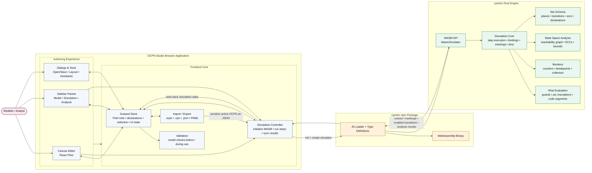

# Architecture Overview

This page gives a documentation-friendly, slide-style overview of how OCPN Studio is structured and how it integrates with `cpnsim`.

## Big Picture

## Reading The Diagram

- The left side is the browser app: React UI, the editor canvas, sidebar panels, and import/export flows.
- The center is the runtime boundary: the simulation controller serializes the current model and talks to the npm package.
- The right side is `cpnsim`: a Rust simulator compiled to WebAssembly and exposed through a thin JS/WASM bridge.

## Core Ideas

- OCPN Studio keeps the editable model in a single Zustand store, including Petri net pages, declarations, selection state, monitors, and analysis results.
- The React UI reads and updates that store through the canvas, property editors, dialogs, and analysis panels.
- When simulation starts, the frontend converts the active in-memory model into the JSON schema expected by `cpnsim`.
- `@rwth-pads/cpnsim` loads the generated JS wrapper plus the `.wasm` binary, then instantiates `WasmSimulator`.
- Inside `cpnsim`, the Rust simulation engine evaluates guards and inscriptions with Rhai, computes enabled bindings, fires transitions, tracks time, and exposes monitor and state-space analysis APIs.
- Results flow back into the frontend as markings, events, enabled transitions, monitor outputs, and reachability/state-space data.

## Typical Runtime Flow

1. The user edits a model on the canvas or in sidebar panels.
2. The Zustand store becomes the current source of truth for the model.
3. The simulation controller serializes that model into the `cpnsim` JSON format.
4. The WebAssembly simulator runs steps and analyses inside the browser.
5. The frontend synchronizes returned markings, time, events, and analysis results back into the store.
6. The UI re-renders the canvas, event log, monitor views, and analysis panels from updated store state.